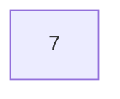
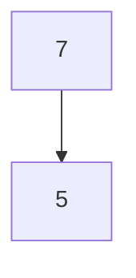

# Binary-Search-Tree-Projesi

*[7, 5, 1, 8, 3, 6, 0, 9, 4, 2] dizisinin Binary-Search-Tree aşamalarını yazınız.*

---

`[7, 5, 1, 8, 3, 6, 0, 9, 4, 2]`

---

**1.** Yukarıda verilen dizinin Binary Search Tree aşamalarını yazınız.

***ilk sayı 7, root olarak seçilir***

***İlk değer olan 7 root seçilir. 5 değeri root değerinden küçük olduğu için sol tarafa yazılır.***

***İlk sayı 7, root olarak seçilir.***

> ***Solunda 5, sağında 8 bulunur.***
> 
> ***5 değerinin solunda 1, sağında 6 bulunur.***
> 
> ***1 değerinin solunda 0, sağında 3 bulunur.***
> 
> ***3 değerinin solunda 2, sağında 4 bulunur.***
> 
> ***8 değerinin sağında 9 bulunur.***